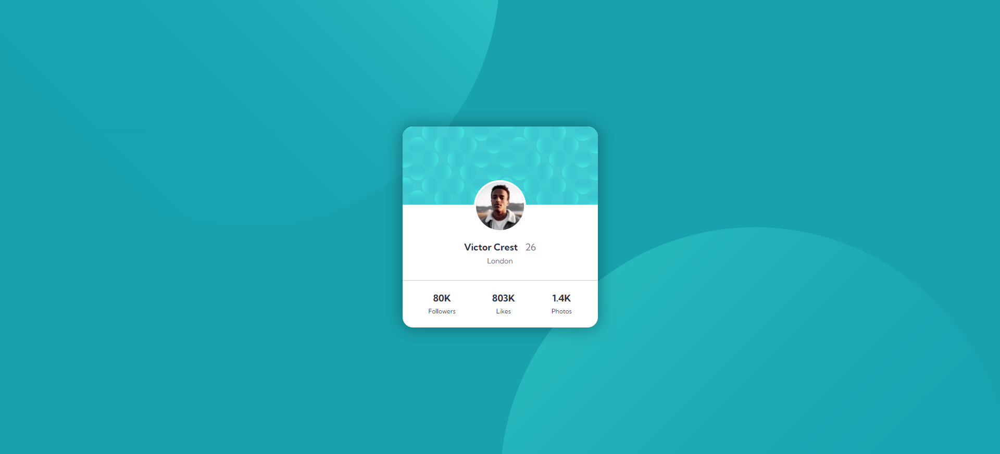

# Frontend Mentor - Profile card component solution

This is a solution to the [Profile card component challenge on Frontend Mentor](https://www.frontendmentor.io/challenges/profile-card-component-cfArpWshJ). Frontend Mentor challenges help you improve your coding skills by building realistic projects.

## Table of contents

- [Overview](#overview)
  - [Screenshot](#screenshot)
  - [Links](#links)
- [My process](#my-process)
  - [Built with](#built-with)
  - [What I learned](#what-i-learned)

## Overview

### Screenshot



### Links

- Solution URL: [Solution URL here](https://www.frontendmentor.io/solutions/profile-card-component-LuVKmxpoNC)
- Live Site URL: [Live site URL here](https://berkcan-profile-card.netlify.app/)

## My process

### Built with

- Semantic HTML5 markup
- CSS custom properties
- Flexbox
- Mobile-first workflow

### What I learned

```css
body {
  overflow: hidden;
  background-image: url(../images/bg-pattern-top.svg),
    url(../images/bg-pattern-bottom.svg);
  background-repeat: no-repeat, no-repeat;
  background-position: right 50vw bottom 50vh, left 50vw top 50vh;
}
```
